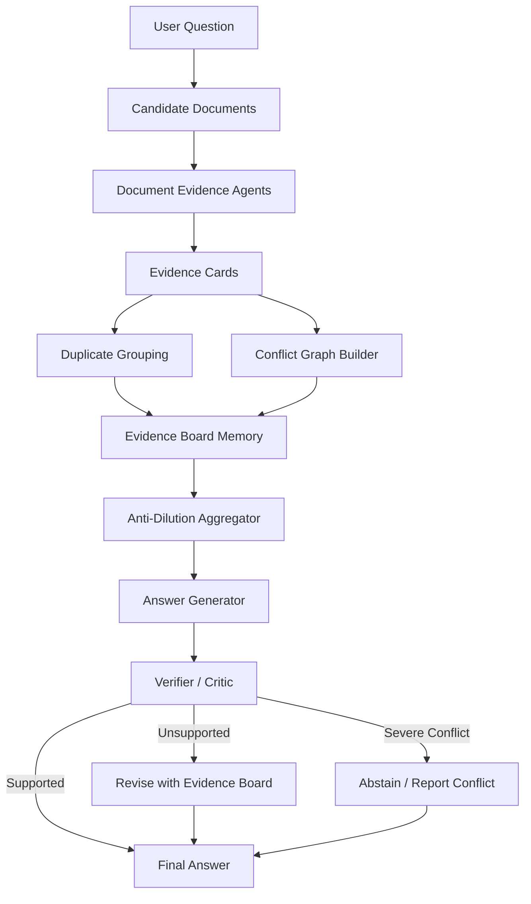

# DirtyRAG-Guard / EvidenceBoard-RAG 工程项目设计文档 v1

> 面向人工智能导论课程项目：**脏知识库下的 RAG 鲁棒性增强与评测基准**  
> 项目目标：先把工程跑通、实验可复现、结果可导出，论文写作后置。  
> 面向读者：Codex / Claude Code / 项目成员 / 后续论文撰写 AI。

---

## 0. 一句话定义项目

本项目实现一个 **training-free、证据中心的 RAG 鲁棒性框架**：在检索结果中存在**冲突证据、错误信息、噪声文档、重复证据、过期信息**时，不直接把文档拼给 LLM，而是先把文档转成结构化证据卡片，构建证据冲突图，再通过验证器决定最终回答、修正、拒答或提示冲突。

项目名称建议：

- 论文/展示名：**EvidenceBoard-RAG**
- 工程名：**DirtyRAG-Guard**
- 简写：**EB-RAG**

推荐英文题目：

> **EvidenceBoard-RAG: A Training-Free Evidence-Centric Framework for Robust RAG over Dirty Knowledge Bases**

---

## 1. 研究背景与问题定义

### 1.1 为什么做这个方向

RAG 的基本思路是：先从外部知识库检索文档，再让大模型基于文档回答。经典 RAG 论文把参数化语言模型和非参数化外部记忆结合起来，用检索到的文档增强知识密集型任务回答能力。

但真实知识库并不干净。实际 RAG 经常遇到：

1. **Conflicting evidence**：不同文档都相关，但答案互相矛盾。
2. **Misinformation**：某些文档包含错误答案。
3. **Noise**：检索结果中夹杂无关文档。
4. **Duplicate evidence**：相同或相似的错误证据重复出现，导致模型误以为错误答案更可信。
5. **Outdated evidence**：旧版本页面或过期政策与新文档冲突。
6. **Ambiguous query**：问题本身有歧义，例如同名实体、多答案场景。

普通 RAG 的流程是：

```text
Query → Retrieve Documents → Concatenate Context → LLM Answer
```

它通常只关心“文档和问题是否相关”，很少显式判断“文档之间是否互相矛盾”。因此在 dirty knowledge base 下，普通 RAG 容易被错误、重复、过期或冲突证据带偏。

### 1.2 本项目研究问题

本项目聚焦 **post-retrieval robustness**：假设系统已经获得了一组候选文档，研究如何在这些候选文档脏、乱、冲突时生成更可靠的答案。

形式化定义：

给定一个问题 \(q\)，候选文档集合 \(D = \{d_1, d_2, ..., d_n\}\)，文档可能包含正确证据、错误证据、噪声证据、重复证据、过期证据。系统需要输出：

- 一个最终回答 \(a\)；或
- 一个拒答/冲突提示，例如 `conflict`、`unknown`、`insufficient evidence`；或
- 一个多答案回答，例如 ambiguity 场景下列出所有有效答案。

核心目标：

> 在相同 LLM、相同候选文档、相同 top-k 条件下，减少错误答案泄漏，提高对冲突/噪声/重复证据的鲁棒性。

---

## 2. 项目产出目标

### 2.1 工程产出

必须产出：

1. 可运行 Python 项目；
2. 数据集下载/转换脚本；
3. 至少 4 个 baseline；
4. 我们的方法 EvidenceBoard-RAG；
5. 统一评估脚本；
6. 结果 CSV / JSONL；
7. 可视化图表；
8. 至少 1 个案例可视化；
9. 可选 Streamlit demo。

### 2.2 实验产出

必须产出：

1. 主结果表：不同方法在 RAMDocs 子集上的表现；
2. 错误答案泄漏率图；
3. Faithfulness / conflict sensitivity / success rate 等指标；
4. 消融实验表；
5. duplicate stress test 曲线；
6. case study：展示 Vanilla RAG 被误导，而 EvidenceBoard-RAG 如何识别冲突。

### 2.3 后续论文可用内容

工程完成后，论文可以直接使用：

- 方法架构图；
- 数据集说明；
- baseline 说明；
- 主实验结果；
- 消融实验；
- 案例分析；
- limitations。

---

## 3. 相关工作与工程依据

本节不是论文完整 Related Work，而是工程选型依据。

### 3.1 RAG：基础 baseline

**Retrieval-Augmented Generation for Knowledge-Intensive NLP Tasks, NeurIPS 2020**

- 作用：定义最基础 RAG 范式。
- 工程中对应：`VanillaRAG`。
- 流程：问题 → 检索 top-k 文档 → 拼接上下文 → LLM 回答。
- 链接：
  - https://proceedings.neurips.cc/paper/2020/hash/6b493230205f780e1bc26945df7481e5-Abstract.html
  - https://arxiv.org/abs/2005.11401

### 3.2 CRAG：纠错型 RAG baseline

**Corrective Retrieval Augmented Generation, 2024**

- 核心：用 lightweight retrieval evaluator 判断检索文档质量，根据 confidence 触发不同动作。
- 工程中对应：`CRAGStyleRAG`。
- 简化复现：判断文档整体质量，过滤无关/低质文档，必要时二次 query rewrite。
- 与本项目差异：CRAG 主要处理“检索质量差”，本项目处理“多个相关文档互相冲突/重复/过期”。
- 链接：
  - https://openreview.net/forum?id=JnWJbrnaUE
  - https://arxiv.org/abs/2401.15884

### 3.3 Self-RAG：只引用，不完整复现

**Self-RAG: Learning to Retrieve, Generate, and Critique through Self-Reflection, ICLR 2024**

- 核心：训练模型生成 reflection tokens，让模型学会检索、生成、自我批判。
- 不作为实验 baseline 原版复现，因为需要训练或使用专门模型。
- 论文中用于说明：我们选择 training-free 框架，成本更低。
- 链接：
  - https://openreview.net/forum?id=hSyW5go0v8
  - https://arxiv.org/abs/2310.11511

### 3.4 RAGAS：评估指标参考

**RAGAS: Automated Evaluation of Retrieval Augmented Generation, EACL 2024 Demo**

- 核心：提供 reference-free RAG 评估指标，例如 faithfulness、answer relevancy、context precision、context recall。
- 工程中可选接入，也可只采用指标思想。
- 链接：
  - https://aclanthology.org/2024.eacl-demo.16/
  - https://arxiv.org/abs/2309.15217

### 3.5 RAGChecker：细粒度诊断参考

**RAGChecker: A Fine-grained Framework for Diagnosing RAG, NeurIPS 2024 Datasets & Benchmarks**

- 核心：同时诊断 retrieval 和 generation 模块，提供细粒度评估框架。
- 工程中借鉴其“不要只看最终答案，还要诊断中间环节”的思想。
- 链接：
  - https://proceedings.neurips.cc/paper_files/paper/2024/hash/27245589131d17368cccdfa990cbf16e-Abstract-Datasets_and_Benchmarks_Track.html
  - https://github.com/amazon-science/RAGChecker

### 3.6 RAMDocs / MADAM-RAG：最贴题的公开数据与前沿方法

**Retrieval-Augmented Generation with Conflicting Evidence, COLM 2025 / arXiv 2025**

- 核心贡献：
  - 提出 RAMDocs 数据集，模拟 ambiguity、misinformation、noise 等真实检索挑战。
  - 提出 MADAM-RAG，多智能体辩论和聚合框架。
- 工程中：
  - RAMDocs 是主数据集。
  - MADAM-RAG-lite 是可选强 baseline。
- GitHub README 显示 RAMDocs 提供 `RAMDocs_test.jsonl`，字段包括 `question`、`documents`、`gold_answers`、`wrong_answers` 等。
- 链接：
  - https://github.com/HanNight/RAMDocs
  - https://openreview.net/forum?id=z1MHB2m3V9
  - https://arxiv.org/abs/2504.13079

### 3.7 FaithEval：补充数据集

**FaithEval: Can Your Language Model Stay Faithful to Context, Even If “The Moon is Made of Marshmallows”, ICLR 2025**

- 核心：评估 LLM 是否忠实于上下文。
- 包含三类任务：unanswerable、inconsistent、counterfactual。
- 工程中优先使用 `FaithEval-inconsistent-v1.0` 作为补充评估集。
- 链接：
  - https://github.com/SalesforceAIResearch/FaithEval
  - https://huggingface.co/datasets/Salesforce/FaithEval-inconsistent-v1.0
  - https://openreview.net/forum?id=UeVx6L59fg

### 3.8 AmbigDocs：歧义多文档补充集

**AmbigDocs, COLM 2024**

- 核心：研究同名实体、多文档歧义下模型是否能区分实体并给出完整答案。
- 工程中作为 optional dataset。
- 链接：
  - https://openreview.net/forum?id=mkYCfO822n

---

## 4. 数据集设计

### 4.1 数据集优先级

| 优先级 | 数据集 | 用途 | 是否必须 |
|---|---|---|---|
| P0 | RAMDocs | 主实验，冲突/错误/噪声文档 | 必须 |
| P1 | FaithEval-inconsistent | 补充测试，冲突上下文与忠实性 | 建议 |
| P2 | AmbigDocs | 歧义实体，多答案 | 可选 |
| P3 | Synthetic Duplicate/Outdated Stress Test | 重复/过期扰动曲线与 demo | 必须作为补充，不作为主实验 |

### 4.2 RAMDocs 字段适配

RAMDocs 原始字段预期：

```json
{
  "question": "...",
  "documents": [
    {
      "text": "...",
      "type": "correct | misinfo | noise",
      "answer": "..."
    }
  ],
  "disambig_entity": ["..."],
  "gold_answers": ["..."],
  "wrong_answers": ["..."]
}
```

统一转换为项目内部格式：

```json
{
  "qid": "ramdocs_000001",
  "dataset": "ramdocs",
  "question": "...",
  "documents": [
    {
      "doc_id": "D1",
      "text": "...",
      "source_type": "correct",
      "source_answer": "...",
      "metadata": {}
    }
  ],
  "gold_answers": ["..."],
  "wrong_answers": ["..."],
  "task_type": "conflict_qa",
  "metadata": {
    "disambig_entity": ["..."]
  }
}
```

注意：

- 方法运行时 **禁止使用** `source_type`、`gold_answers`、`wrong_answers`。
- 这些字段只能由 evaluator 使用。
- 这条规约非常重要，否则会发生数据泄漏。

### 4.3 FaithEval-inconsistent 字段适配

FaithEval 可通过 HuggingFace 加载：

```python
from datasets import load_dataset

dataset = load_dataset("Salesforce/FaithEval-inconsistent-v1.0", split="test")
```

统一转换规则：

- `question` → 内部 `question`
- `context` → 如果是长文本，按段落/编号拆成多个文档；如果无法拆分，则作为一个文档。
- expected behavior：如果上下文有冲突，理想回答应包含 `conflict` / `contradiction` / `multiple answers` 等语义。

内部格式：

```json
{
  "qid": "faitheval_inconsistent_000001",
  "dataset": "faitheval_inconsistent",
  "question": "...",
  "documents": [
    {"doc_id": "D1", "text": "...", "source_type": "unknown"}
  ],
  "gold_answers": ["conflict"],
  "wrong_answers": [],
  "task_type": "inconsistency_detection"
}
```

### 4.4 Synthetic Duplicate/Outdated Stress Test

公开数据主要覆盖 misinformation、noise、ambiguity，但 duplicate/outdated 场景未必充分。因此构造补充 stress test。

原则：

- 只作为补充，不作为主实验；
- 明确标注 synthetic；
- 用于展示机制价值，不用于宣称 SOTA。

构造方式：

1. 从 RAMDocs 中选出含 correct 和 misinfo 的样本；
2. 对 misinfo 文档复制 1、3、5、7 次，制造重复错误证据；
3. 对部分 correct 文档加时间标签，例如 `2024 updated policy`；
4. 对错误文档加旧时间标签，例如 `2021 archived policy`；
5. 测试模型是否被重复错误证据带偏。

内部格式：

```json
{
  "qid": "stress_dup_000001",
  "dataset": "synthetic_duplicate",
  "question": "...",
  "documents": [
    {"doc_id": "D1", "text": "Correct answer ...", "source_type": "correct"},
    {"doc_id": "D2", "text": "Wrong answer ...", "source_type": "misinfo", "duplicate_group": "G_wrong"},
    {"doc_id": "D3", "text": "Wrong answer ...", "source_type": "misinfo", "duplicate_group": "G_wrong"}
  ],
  "gold_answers": ["..."],
  "wrong_answers": ["..."],
  "task_type": "duplicate_stress",
  "metadata": {
    "duplicate_wrong_count": 2
  }
}
```

---

## 5. 总体方法设计：EvidenceBoard-RAG

### 5.1 设计原则

1. **不训练新大模型**：training-free。
2. **固定同一 LLM**：所有 baseline 和 ours 使用同一个 LLM。
3. **固定候选文档**：RAMDocs 已提供 retrieved documents，主实验不比较 retriever 能力，只比较 post-retrieval robustness。
4. **显式证据结构化**：不直接拼接所有文档，而是先构造 Evidence Card。
5. **显式冲突建模**：不是只判断 relevance，还判断 claim-level contradiction。
6. **抗重复证据稀释**：重复错误证据不能因为数量多而获得更高权重。
7. **保留拒答/冲突提示能力**：在证据冲突严重时，允许输出 conflict / insufficient evidence。
8. **可解释输出**：保存 Evidence Board、Conflict Graph、Verifier Decision，方便 case study。

### 5.2 总体架构图

建议论文/展示图按下面结构绘制：



更适合放论文模型图的视觉布局：

```text
┌─────────────────────────────────────────────────────────────┐
│                      User Question                          │
└──────────────────────────────┬──────────────────────────────┘
                               ↓
┌─────────────────────────────────────────────────────────────┐
│                 Retrieved / Provided Documents              │
│       D1, D2, D3, ... with noisy/conflicting evidence        │
└──────────────────────────────┬──────────────────────────────┘
                               ↓
┌─────────────────────────────────────────────────────────────┐
│               Document Evidence Agents                      │
│  extract answer candidate, claim, relevance, temporal cue    │
└──────────────────────────────┬──────────────────────────────┘
                               ↓
┌─────────────────────────────────────────────────────────────┐
│                    Evidence Board                           │
│ Evidence Cards + Duplicate Groups + Conflict Graph          │
└──────────────────────────────┬──────────────────────────────┘
                               ↓
┌─────────────────────────────────────────────────────────────┐
│           Anti-Dilution Aggregation & Answer Generation     │
└──────────────────────────────┬──────────────────────────────┘
                               ↓
┌─────────────────────────────────────────────────────────────┐
│             Verifier: support / revise / abstain            │
└──────────────────────────────┬──────────────────────────────┘
                               ↓
┌─────────────────────────────────────────────────────────────┐
│                       Final Answer                          │
└─────────────────────────────────────────────────────────────┘
```

### 5.3 Evidence Card 设计

每个文档先转成 Evidence Card。

数据结构：

```json
{
  "doc_id": "D1",
  "relevance": "high | medium | low",
  "answer_candidate": "June 1",
  "claim": "The application deadline is June 1.",
  "stance": "support | misinfo | noise | unknown",
  "temporal_status": "current | outdated | unknown",
  "time_cue": "2024 updated policy",
  "confidence": 0.82,
  "rationale": "The document directly states the deadline.",
  "raw_quote": "..."
}
```

注意：

- `stance` 是模型预测，不是用 RAMDocs 的 `type`。
- `raw_quote` 用于引用和可解释性。
- `confidence` 不做绝对可信，只用于排序。

### 5.4 Conflict Graph 设计

节点：Evidence Card。  
边：证据之间的关系。

边类型：

| relation | 含义 |
|---|---|
| `support` | 两个证据支持同一答案 |
| `contradict` | 两个证据答案互相矛盾 |
| `duplicate` | 两个证据几乎重复 |
| `temporal_conflict` | 新旧版本冲突 |
| `irrelevant` | 至少一方与问题无关 |

边结构：

```json
{
  "src": "D1",
  "dst": "D2",
  "relation": "contradict",
  "reason": "D1 says June 1, D2 says June 15.",
  "confidence": 0.91
}
```

实现上可以简化：

1. 先按 `answer_candidate` 聚类；
2. 相同候选答案 → support / duplicate；
3. 不同候选答案且都 relevant → contradict；
4. 检测重复文本相似度 > 阈值 → duplicate；
5. 时间 cue 明显旧 → outdated。

### 5.5 Evidence Board Memory

Evidence Board 是共享记忆，不是简单 prompt 串联。它保存：

```json
{
  "qid": "...",
  "question": "...",
  "cards": [...],
  "duplicate_groups": [...],
  "conflict_edges": [...],
  "answer_clusters": [...],
  "decision_trace": [...]
}
```

它用于满足课程中“多 Agent 通信协议”和“记忆存储机制”的要求：

- Document Agent 只写卡片；
- Conflict Builder 读取卡片，写图；
- Aggregator 读取图，写候选结论；
- Verifier 读取候选结论和证据板，做最终判断。

这比“几个 prompt 直接串起来”更像工程化 Agent workflow。

### 5.6 Anti-Dilution Aggregation

普通 RAG 容易被重复错误文档带偏，因为重复文档在 prompt 中占据更多 token 和注意力。

本项目聚合时不按文档数量投票，而是按 **answer cluster / duplicate group** 聚合。

简化公式：

```text
cluster_score(answer) = mean(confidence of unique evidence groups)
                      + relevance_bonus
                      - conflict_penalty
                      - outdated_penalty
```

示例：

```text
D1: correct answer A
D2: wrong answer B
D3: wrong answer B duplicate of D2
D4: wrong answer B duplicate of D2
```

普通多数投票可能选 B。  
Anti-Dilution Aggregation 应该把 D2/D3/D4 视为同一 duplicate group，避免重复错误证据支配答案。

### 5.7 Verifier / Critic 设计

Verifier 输入：

- question；
- candidate answer；
- evidence board 摘要；
- supporting quotes；
- conflict summary。

输出：

```json
{
  "verdict": "supported | revise | conflict | unknown",
  "final_answer": "...",
  "supporting_doc_ids": ["D1", "D4"],
  "rejected_doc_ids": ["D2"],
  "reason": "The answer is supported by D1 and D4, while D2 is outdated."
}
```

策略：

- 如果一个 answer cluster 明显可信 → 输出答案；
- 如果多个高可信 cluster 冲突 → 输出 conflict 或列出多个有效答案；
- 如果证据不足 → 输出 unknown；
- 如果候选答案引用了 rejected docs → revise。

---

## 6. Baseline 设计

### 6.1 最小必须复现 baseline

| ID | 方法 | 对应论文/依据 | 复现难度 | 是否必须 |
|---|---|---|---|---|
| B0 | Direct LLM | closed-book 对照 | 极低 | 必须 |
| B1 | Vanilla RAG | RAG, NeurIPS 2020 | 低 | 必须 |
| B2 | RAG + Relevance Filter | 常见工程增强 / RAGAS context relevance 思想 | 低 | 必须 |
| B3 | CRAG-style RAG | CRAG, 2024 | 中 | 必须 |
| B4 | MADAM-RAG-lite | RAMDocs/MADAM-RAG, 2025 | 中高 | 可选 |

### 6.2 Baseline 具体实现

#### B0 Direct LLM

输入只有 question。

```text
Question → LLM → Answer
```

用途：证明不使用外部文档时模型容易乱猜或无法处理数据集中的实体细节。

#### B1 Vanilla RAG

输入 question + 所有候选文档。

```text
Question + Concatenated Docs → LLM → Answer
```

Prompt 要求：

- 只基于 context 回答；
- 如果有多个有效答案，尽量列出；
- 如果不知道则 unknown。

#### B2 RAG + Relevance Filter

步骤：

1. 对每个文档判断 relevance：0/1/2；
2. 保留 relevance >= 1 或 top-m；
3. 拼接保留文档；
4. LLM 回答。

作用：说明单纯过滤无关文档无法解决“相关但冲突”的文档。

#### B3 CRAG-style RAG

课程简化版：

1. 检索文档整体质量判断：`correct / ambiguous / incorrect`；
2. 若 `correct`：直接回答；
3. 若 `ambiguous`：过滤低相关文档，再回答；
4. 若 `incorrect`：尝试 query rewrite 或输出 unknown；
5. 不接 web search，避免外部变量干扰。

注意：

- 原版 CRAG 有 web search 和 decompose-then-recompose，这里只做简化版。
- 论文/报告中写 `CRAG-style`，不要写完整复现原版 CRAG。

#### B4 MADAM-RAG-lite，可选

简化版一轮 debate：

1. 每个文档单独生成一个 doc-specific answer；
2. Aggregator 聚合所有 doc answers；
3. 如果多个 answer 冲突，尝试输出多答案或 conflict。

作用：作为最贴近本项目的强相关 baseline。

不建议一开始就做多轮 debate，token 成本和随机性都高。

---

## 7. 指标设计

### 7.1 RAMDocs 主指标

RAMDocs 有 `gold_answers` 和 `wrong_answers`，因此设计如下指标。

#### 7.1.1 Gold Answer Coverage，越高越好

模型回答中覆盖了多少 gold answer。

```text
gold_coverage = mentioned_gold_answers / total_gold_answers
```

如果只有一个 gold answer，则等价于是否答对。

#### 7.1.2 Wrong Answer Leakage，越低越好

模型回答中是否泄漏了错误答案。

```text
wrong_leakage = 1 if any wrong_answer appears in prediction else 0
```

#### 7.1.3 Strict Success，越高越好

严格成功：覆盖所有 gold answers，并且不包含 wrong answers。

```text
strict_success = (gold_coverage == 1.0) and (wrong_leakage == 0)
```

#### 7.1.4 Conflict Sensitivity，越高越好

当文档中存在多个 answer cluster 或 misinfo 时，模型是否意识到冲突/歧义。

可以用关键词 + LLM judge 混合：

关键词：

```text
conflict, contradictory, inconsistent, multiple answers, ambiguity, disputed
```

或者中文：

```text
冲突, 矛盾, 多个答案, 歧义, 不一致
```

#### 7.1.5 Noise Robustness，越高越好

在包含 noise documents 的样本中，模型是否仍然 strict success。

#### 7.1.6 Token Cost / Latency，越低越好

记录每个方法：

- prompt tokens；
- completion tokens；
- total tokens；
- runtime seconds；
- API cost estimate。

### 7.2 FaithEval-inconsistent 指标

FaithEval inconsistent 任务希望模型识别上下文冲突。

准确标准：预测中包含冲突语义。

有效短语：

```text
conflict, multiple answers, disagreement, inconsistent, contradictory, contradiction, two answers
```

指标：

```text
inconsistency_accuracy = number_of_conflict_predictions / total_examples
```

### 7.3 Synthetic Duplicate Stress 指标

#### 7.3.1 Duplicate Susceptibility，越低越好

随着重复错误文档数量增加，模型被错误答案带偏的概率。

```text
duplicate_susceptibility(k) = wrong_leakage_rate when wrong doc duplicated k times
```

#### 7.3.2 Evidence Dilution Rate，越低越好

错误重复证据是否稀释了正确证据。

```text
evidence_dilution = success_at_k0 - success_at_k
```

### 7.4 可选 LLM Judge 指标

可选接入：

- faithfulness；
- answer relevance；
- citation support；
- groundedness。

注意：LLM judge 结果要作为辅助指标，主指标优先使用 gold/wrong answer string matching。

---

## 8. 可视化设计

必须生成：

### 8.1 主结果柱状图

图名：`Main performance on RAMDocs subset`

x 轴：method  
y 轴：strict success / gold coverage / wrong leakage

建议生成三张图：

1. Strict Success by Method；
2. Wrong Answer Leakage by Method；
3. Gold Coverage by Method。

### 8.2 成本-效果图

图名：`Performance-cost trade-off`

x 轴：平均 token cost  
y 轴：strict success

用于说明 Ours 更强但成本更高。

### 8.3 消融实验柱状图

x 轴：variant  
y 轴：strict success / wrong leakage

variants：

- Full EB-RAG；
- w/o Conflict Graph；
- w/o Deduplication；
- w/o Verifier；
- w/o Abstention；
- w/o Evidence Card。

### 8.4 Duplicate Stress 曲线

x 轴：wrong duplicate count，例如 0、1、3、5、7  
y 轴：wrong leakage rate

预期：Vanilla RAG 随重复错误文档增加更容易泄漏错误答案；EB-RAG 曲线更平稳。

### 8.5 Case Study Evidence Graph

对一个样本画出：

- 文档节点；
- correct/misinfo/noise 颜色；
- contradict/duplicate 边；
- 最终选择答案。

可以用 `networkx + matplotlib` 输出 PNG。

---

## 9. 工程架构设计

### 9.1 推荐技术栈

基础：

```text
Python 3.10+
pandas
numpy
pydantic
pyyaml
tqdm
tenacity
openai
matplotlib
networkx
scikit-learn
rapidfuzz
datasets
```

可选：

```text
streamlit
ragas
sentence-transformers
faiss-cpu
rank-bm25
```

注意：主实验不强依赖向量检索，因为 RAMDocs 已经提供候选文档。

### 9.2 项目目录

```text
dirtyrag_guard/
  README.md
  requirements.txt
  .env.example
  configs/
    default.yaml
    quick.yaml
    ablation.yaml
  data/
    raw/
      ramdocs/
      faitheval/
    processed/
      ramdocs_50.jsonl
      faitheval_inconsistent_50.jsonl
      synthetic_duplicate.jsonl
    cache/
      llm_calls.jsonl
  outputs/
    runs/
      run_YYYYMMDD_HHMMSS/
        predictions.jsonl
        metrics.csv
        per_case_metrics.csv
        evidence_boards/
        figures/
        logs.txt
  src/
    dirtyrag/
      __init__.py
      schemas.py
      llm_client.py
      prompts.py
      utils.py
      data/
        download.py
        prepare_ramdocs.py
        prepare_faitheval.py
        build_synthetic.py
      methods/
        base.py
        direct_llm.py
        vanilla_rag.py
        relevance_filter_rag.py
        crag_style_rag.py
        madam_rag_lite.py
        evidenceboard_rag.py
      evaluation/
        normalize.py
        metrics.py
        judge.py
        evaluate.py
      visualization/
        plot_results.py
        plot_graph.py
      cli.py
  scripts/
    run_quick.sh
    run_main.sh
    run_ablation.sh
  tests/
    test_normalize.py
    test_metrics.py
    test_schema.py
```

### 9.3 配置文件

`configs/default.yaml`：

```yaml
run:
  seed: 42
  output_dir: outputs/runs
  max_examples: 50
  methods:
    - direct_llm
    - vanilla_rag
    - relevance_filter_rag
    - crag_style_rag
    - evidenceboard_rag

dataset:
  name: ramdocs
  path: data/processed/ramdocs_50.jsonl
  max_docs_per_example: 12

llm:
  provider: openai_compatible
  model: gpt-4o-mini
  base_url: ${LLM_BASE_URL}
  api_key: ${LLM_API_KEY}
  temperature: 0
  max_tokens: 512
  timeout: 60
  retry: 3

prompts:
  language: en
  answer_style: concise

evaluation:
  normalize: true
  use_llm_judge: false
  save_evidence_board: true

cost:
  track_tokens: true
```

### 9.4 环境变量

`.env.example`：

```bash
LLM_API_KEY=your_api_key
LLM_BASE_URL=https://api.openai.com/v1
LLM_MODEL=gpt-4o-mini
```

如果用兼容接口，只需替换 base_url 和 model。

---

## 10. 数据结构与接口规约

### 10.1 Pydantic Schema

`schemas.py`：

```python
from typing import Any, Dict, List, Optional, Literal
from pydantic import BaseModel, Field

class Document(BaseModel):
    doc_id: str
    text: str
    source_type: Optional[str] = None  # only for evaluation; methods must not use it
    source_answer: Optional[str] = None
    metadata: Dict[str, Any] = Field(default_factory=dict)

class QAExample(BaseModel):
    qid: str
    dataset: str
    question: str
    documents: List[Document]
    gold_answers: List[str] = Field(default_factory=list)
    wrong_answers: List[str] = Field(default_factory=list)
    task_type: str = "conflict_qa"
    metadata: Dict[str, Any] = Field(default_factory=dict)

class MethodResult(BaseModel):
    qid: str
    method: str
    answer: str
    raw_response: str
    used_doc_ids: List[str] = Field(default_factory=list)
    evidence_board_path: Optional[str] = None
    latency_sec: Optional[float] = None
    prompt_tokens: Optional[int] = None
    completion_tokens: Optional[int] = None
    total_tokens: Optional[int] = None
    metadata: Dict[str, Any] = Field(default_factory=dict)
```

### 10.2 Method Interface

`methods/base.py`：

```python
from abc import ABC, abstractmethod
from dirtyrag.schemas import QAExample, MethodResult

class BaseMethod(ABC):
    name: str

    @abstractmethod
    def run(self, example: QAExample) -> MethodResult:
        pass
```

所有 baseline 和 ours 必须继承 `BaseMethod`。

### 10.3 LLM Client 规约

`llm_client.py`：

要求：

- 支持 OpenAI-compatible Chat Completions；
- temperature 默认为 0；
- 自动 retry；
- 缓存相同 prompt 结果；
- 记录 token 和 latency；
- 支持 JSON mode fallback：如果模型输出非法 JSON，尝试一次 repair。

接口：

```python
class LLMClient:
    def chat(self, messages: list[dict], *, max_tokens: int = 512, temperature: float = 0) -> LLMResponse:
        ...

    def json_chat(self, messages: list[dict], schema_hint: str, *, max_tokens: int = 512) -> dict:
        ...
```

---

## 11. Prompt 规约

### 11.1 全局约束

所有 prompt 都必须：

1. 要求模型只基于给定 context；
2. 不允许调用外部知识；
3. 如果证据不足，输出 `unknown`；
4. 如果证据冲突，输出 `conflict` 或列出多个答案；
5. 输出尽量短，方便评估；
6. 方法之间 prompt 风格尽量公平。

### 11.2 Vanilla RAG Prompt

```text
You are a retrieval-augmented question answering system.
Answer the question using only the provided documents.
If the documents contain multiple valid answers, list all valid answers.
If the answer is not supported by the documents, answer "unknown".
If the documents are contradictory and no reliable resolution is possible, answer "conflict".

Question:
{question}

Documents:
{documents}

Final answer:
```

### 11.3 Relevance Judge Prompt

```text
You are judging whether a document is useful for answering a question.
Return JSON only.

Question: {question}
Document: {document}

Output schema:
{
  "relevance": 0 | 1 | 2,
  "reason": "short reason"
}

Definitions:
0 = irrelevant/noise
1 = partially relevant
2 = directly relevant
```

### 11.4 Evidence Card Prompt

```text
You are an evidence extraction agent.
Extract a structured evidence card from the document for the question.
Use only the document. Do not use external knowledge.
Return JSON only.

Question:
{question}

Document ID:
{doc_id}

Document:
{document}

Output schema:
{
  "doc_id": "...",
  "relevance": "high|medium|low",
  "answer_candidate": "short answer or unknown",
  "claim": "one sentence claim relevant to the question",
  "temporal_status": "current|outdated|unknown",
  "time_cue": "time cue if any, otherwise unknown",
  "confidence": 0.0,
  "raw_quote": "short quote supporting the extracted claim",
  "rationale": "short reason"
}
```

### 11.5 Verifier Prompt

```text
You are a strict answer verifier.
Given the question, candidate answer, and evidence board, determine whether the answer is supported.
Return JSON only.

Question:
{question}

Candidate answer:
{candidate_answer}

Evidence board summary:
{evidence_board_summary}

Output schema:
{
  "verdict": "supported|revise|conflict|unknown",
  "final_answer": "...",
  "supporting_doc_ids": ["..."],
  "rejected_doc_ids": ["..."],
  "reason": "short reason"
}
```

---

## 12. 实验设计

### 12.1 主实验设置

主实验：RAMDocs 子集。

建议规模：

- quick run：10 examples；
- main run：50 examples；
- 如果时间/API 预算允许：100 examples。

方法：

```text
B0 Direct LLM
B1 Vanilla RAG
B2 RAG + Relevance Filter
B3 CRAG-style RAG
Ours EvidenceBoard-RAG
Optional B4 MADAM-RAG-lite
```

固定条件：

- 同一 LLM；
- 同一文档集合；
- temperature = 0；
- max docs per example = 12；
- max output tokens = 512；
- 同一评估脚本。

### 12.2 消融实验

只在 20～50 个样本上跑即可。

variants：

| Variant | 说明 |
|---|---|
| Full EB-RAG | 完整方法 |
| w/o Evidence Card | 不结构化，直接拼接文档 |
| w/o Conflict Graph | 不显式判断冲突关系 |
| w/o Deduplication | 不做重复证据聚类 |
| w/o Verifier | 不做最终验证 |
| w/o Abstention | 不允许 conflict/unknown，只能强行回答 |

### 12.3 Duplicate Stress Test

选择 10 个 RAMDocs 样本，构造重复错误证据数量：

```text
k = 0, 1, 3, 5, 7
```

对比：

```text
Vanilla RAG
RAG + Filter
CRAG-style RAG
EvidenceBoard-RAG
```

输出：

- wrong leakage rate vs k；
- strict success vs k。

### 12.4 Case Study

至少选择 2 个案例：

1. Vanilla RAG 被 misinfo 带偏，EB-RAG 正确；
2. 重复错误证据增加后，Vanilla RAG 错误，EB-RAG 通过 dedup 保持稳定；
3. 如果有反例，也选 1 个 EB-RAG 失败案例，体现诚实性。

---

## 13. 运行命令设计

### 13.1 安装

```bash
python -m venv .venv
source .venv/bin/activate  # Windows: .venv\Scripts\activate
pip install -r requirements.txt
cp .env.example .env
```

### 13.2 下载和准备数据

```bash
python -m dirtyrag.data.download --dataset ramdocs
python -m dirtyrag.data.prepare_ramdocs --input data/raw/ramdocs/RAMDocs_test.jsonl --output data/processed/ramdocs_50.jsonl --limit 50
python -m dirtyrag.data.prepare_faitheval --output data/processed/faitheval_inconsistent_50.jsonl --limit 50
python -m dirtyrag.data.build_synthetic --input data/processed/ramdocs_50.jsonl --output data/processed/synthetic_duplicate.jsonl
```

### 13.3 quick run

```bash
python -m dirtyrag.cli run --config configs/quick.yaml
```

### 13.4 main run

```bash
python -m dirtyrag.cli run --config configs/default.yaml
```

### 13.5 evaluation

```bash
python -m dirtyrag.cli evaluate --run-dir outputs/runs/latest
```

### 13.6 visualization

```bash
python -m dirtyrag.cli plot --run-dir outputs/runs/latest
```

### 13.7 ablation

```bash
python -m dirtyrag.cli run --config configs/ablation.yaml
python -m dirtyrag.cli evaluate --run-dir outputs/runs/latest
python -m dirtyrag.cli plot --run-dir outputs/runs/latest
```

---

## 14. 输出文件规约

每次运行产生：

```text
outputs/runs/run_YYYYMMDD_HHMMSS/
  config.yaml
  predictions.jsonl
  metrics.csv
  per_case_metrics.csv
  evidence_boards/
    qid_method.json
  figures/
    main_strict_success.png
    wrong_leakage.png
    gold_coverage.png
    cost_tradeoff.png
    ablation.png
    duplicate_stress.png
    case_graph_qid.png
  logs.txt
```

`predictions.jsonl` 单行格式：

```json
{
  "qid": "ramdocs_000001",
  "method": "evidenceboard_rag",
  "answer": "...",
  "raw_response": "...",
  "used_doc_ids": ["D1", "D3"],
  "latency_sec": 8.23,
  "prompt_tokens": 3500,
  "completion_tokens": 120,
  "total_tokens": 3620,
  "evidence_board_path": "outputs/.../evidence_boards/ramdocs_000001_evidenceboard_rag.json"
}
```

`metrics.csv`：

```csv
method,num_examples,strict_success,gold_coverage,wrong_leakage,conflict_sensitivity,avg_latency,avg_total_tokens
vanilla_rag,50,0.32,0.51,0.42,0.20,2.1,2600
evidenceboard_rag,50,0.46,0.63,0.25,0.55,8.7,5200
```

注意：这里数字只是格式示例，不是预期真实结果。

---

## 15. 两人分工建议

### 成员 A：数据、评估、可视化、报告资产

任务：

1. 数据下载与转换；
2. metrics 实现；
3. 可视化脚本；
4. case study 选择；
5. 结果表导出；
6. 后续论文实验部分素材整理。

验收：

- `data/processed/ramdocs_50.jsonl` 可生成；
- `metrics.csv` 可生成；
- 至少 5 张图可生成；
- case graph 可生成。

### 成员 B：方法、baseline、LLM Client、工程主流程

任务：

1. LLM client；
2. prompt 模板；
3. baseline 实现；
4. EvidenceBoard-RAG 实现；
5. CLI 主流程；
6. API cache / retry。

验收：

- B0/B1/B2/B3/Ours 都能跑通；
- quick run 10 examples 成功；
- 每个方法输出 prediction；
- EvidenceBoard JSON 可保存。

### 两人 1 天节奏

| 时间 | 任务 |
|---|---|
| 0-1h | 建仓库、装环境、读数据格式 |
| 1-3h | A 做数据转换和 metrics；B 做 LLM client 和 B0/B1 |
| 3-5h | A 做可视化初版；B 做 B2/B3 |
| 5-7h | B 做 EvidenceBoard-RAG；A 做 synthetic duplicate |
| 7-9h | quick run + bugfix |
| 9-11h | main run 50 examples + evaluation |
| 11-12h | 图表、case study、整理结果 |

---

## 16. 验收标准

### 16.1 最低可交付

必须满足：

- [ ] 能下载或读取 RAMDocs；
- [ ] 能转换为统一 JSONL；
- [ ] 能跑 10 个 quick examples；
- [ ] 至少包含 Direct LLM、Vanilla RAG、CRAG-style、EvidenceBoard-RAG；
- [ ] 能输出 `predictions.jsonl`；
- [ ] 能输出 `metrics.csv`；
- [ ] 能生成至少 3 张图；
- [ ] 能保存至少 1 个 Evidence Board JSON；
- [ ] README 有完整运行命令。

### 16.2 标准可交付

- [ ] RAMDocs 50 examples 主实验；
- [ ] 5 个方法：B0/B1/B2/B3/Ours；
- [ ] ablation 至少 3 个 variants；
- [ ] duplicate stress test；
- [ ] 5 张图；
- [ ] 2 个 case study；
- [ ] 所有结果可复现。

### 16.3 优秀可交付

- [ ] 加 FaithEval-inconsistent 50 examples；
- [ ] 加 MADAM-RAG-lite；
- [ ] 加 Streamlit demo；
- [ ] 加 LLM judge faithfulness；
- [ ] 生成论文用 LaTeX 表格；
- [ ] 输出 model figure 草图和 case graph。

---

## 17. 关键约束与防翻车规约

### 17.1 不要数据泄漏

方法运行时禁止读取：

- `source_type`
- `gold_answers`
- `wrong_answers`

这些只给 evaluator 用。

### 17.2 不要吹 SOTA

工程和论文中不要写：

> state-of-the-art model

建议写：

> a lightweight training-free framework

> a course-scale controlled evaluation

> improves robustness under dirty retrieved evidence

### 17.3 不要求所有指标都赢

合理预期：

- 在 conflict / duplicate / misinformation 场景，Ours 可能更稳；
- 在 clean 场景，Ours 可能因多步判断引入额外错误；
- Ours token cost 和 latency 必然更高；
- 某些样本 baseline 可能更好，要如实报告。

### 17.4 固定随机性

- temperature = 0；
- 固定 seed；
- 保存 prompt；
- 缓存 LLM 调用；
- 记录模型名称和时间。

### 17.5 模型调用失败处理

- retry 3 次；
- exponential backoff；
- JSON parse 失败时做 repair；
- 仍失败则记录 error，不中断全局实验。

---

## 18. Codex 开发提示词

可以直接把下面这段喂给 Codex：

```text
你是一个资深 Python 工程师。请根据项目设计文档实现 DirtyRAG-Guard / EvidenceBoard-RAG 项目。

目标：实现一个 training-free RAG 鲁棒性评测项目，用 RAMDocs 数据集评估 Direct LLM、Vanilla RAG、RAG + Relevance Filter、CRAG-style RAG 和 EvidenceBoard-RAG。

硬性要求：
1. 使用 Python 3.10+。
2. 项目结构按文档中的 dirtyrag_guard 目录设计。
3. 所有数据统一转换为 QAExample JSONL。
4. 方法运行时不得读取 source_type、gold_answers、wrong_answers，避免数据泄漏。
5. 所有方法继承 BaseMethod，输出 MethodResult。
6. LLM Client 支持 OpenAI-compatible API，使用 .env 中的 LLM_API_KEY、LLM_BASE_URL、LLM_MODEL。
7. temperature 固定为 0。
8. 实现 API retry、缓存、JSON 输出修复。
9. 实现 metrics：gold_coverage、wrong_leakage、strict_success、conflict_sensitivity、avg latency、avg tokens。
10. 实现可视化：主结果柱状图、wrong leakage 图、cost tradeoff、duplicate stress 曲线、case graph。
11. 提供 README 和运行命令。
12. 优先保证 quick run 10 examples 可跑通，再扩展 main run 50 examples。

请分阶段实现：
第一阶段：schemas、llm_client、data adapter、metrics。
第二阶段：DirectLLM、VanillaRAG、RelevanceFilterRAG、CRAGStyleRAG。
第三阶段：EvidenceBoardRAG，包括 EvidenceCard、ConflictGraph、Anti-Dilution Aggregation、Verifier。
第四阶段：CLI、evaluation、visualization。
第五阶段：tests 和 README。

请不要过度工程化，不要引入复杂训练流程。这个项目不训练模型，只做 training-free pipeline。
```

---

## 19. 后续论文写作接口

工程完成后，论文素材从以下文件提取：

| 论文部分 | 工程输出 |
|---|---|
| Method | EvidenceBoard-RAG 架构图、Evidence Card JSON、Conflict Graph |
| Experiments | configs、datasets、baseline 实现说明 |
| Results | metrics.csv、figures |
| Ablation | ablation metrics 和图 |
| Case Study | evidence_boards + case_graph |
| Limitations | latency/token cost、失败样本 |

论文叙事核心：

> 普通 RAG 关注“能否检索到相关文档”，但 dirty knowledge base 下真正的问题是“相关文档之间是否一致”。EvidenceBoard-RAG 通过 Evidence Card、Conflict Graph 和 Anti-Dilution Aggregation 将文档级上下文转换为证据级结构化记忆，从而在冲突、误导和重复证据场景下提升回答鲁棒性。

---

## 20. 最终工程目标总结

最低目标不是发顶会，也不是训练新模型，而是做出一个完整、可运行、可评估、可解释的 RAG 鲁棒性项目。

最小实验闭环：

```text
RAMDocs 50 examples
→ Direct LLM / Vanilla RAG / RAG+Filter / CRAG-style / EvidenceBoard-RAG
→ predictions.jsonl
→ metrics.csv
→ figures
→ case study
```

核心创新闭环：

```text
Dirty retrieved docs
→ Evidence Cards
→ Conflict Graph
→ Duplicate-aware aggregation
→ Verifier
→ More robust final answer / conflict report
```

验收一句话：

> 给定 RAMDocs 中含冲突、错误和噪声的候选文档，本项目能够自动运行多个 RAG baseline 和 EvidenceBoard-RAG，输出统一指标、图表和可解释证据板，用于支撑后续课程论文撰写。

